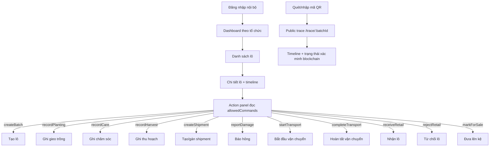

# User Flow v1

Nguyên tắc FE: màn hình chỉ render action khi API trả về `allowedCommands`. FE không tự quyết định role/state matrix; khi BE-03 chốt matrix, thay mock contract bằng API thật.

## FARM_STAFF

Entry: đăng nhập -> dashboard -> danh sách lô thuộc farm organization.

Màn hình/action:

- Batch list: tạo lô nếu backend trả `createBatch`.
- Batch detail: ghi gieo trồng, chăm sóc, thu hoạch, tạo shipment, báo hỏng nếu các command tương ứng xuất hiện trong `allowedCommands`.
- QR panel: xem URL truy xuất công khai của batch.

## TRANSPORTER

Entry: đăng nhập -> shipment được gán cho organization vận chuyển.

Màn hình/action:

- Shipment list: xem các shipment được gán.
- Batch/shipment detail: bắt đầu vận chuyển, hoàn tất vận chuyển, báo hỏng nếu API trả command tương ứng.
- Timeline: xem bằng chứng chain/off-chain liên quan shipment.

## RETAILER

Entry: đăng nhập -> shipment có `destinationRetailerOrg` là organization hiện tại.

Màn hình/action:

- Incoming shipments: xem shipment đang chờ nhận/từ chối.
- Batch/shipment detail: nhận lô, từ chối lô, đưa lên kệ nếu API trả command tương ứng.
- QR/public preview: kiểm tra trải nghiệm người tiêu dùng trước khi bán.

## CONSUMER/AUDITOR

Entry consumer: quét QR hoặc nhập mã batch, không cần đăng nhập.

Entry auditor: đăng nhập hoặc link nội bộ, chỉ đọc.

Màn hình/action:

- Scan/manual entry: mở `/trace/{batchId}`.
- Public trace: hồ sơ lô, trạng thái hiện tại, timeline, proof status.
- Auditor view: đọc lịch sử và bằng chứng; không render action ghi dữ liệu.
