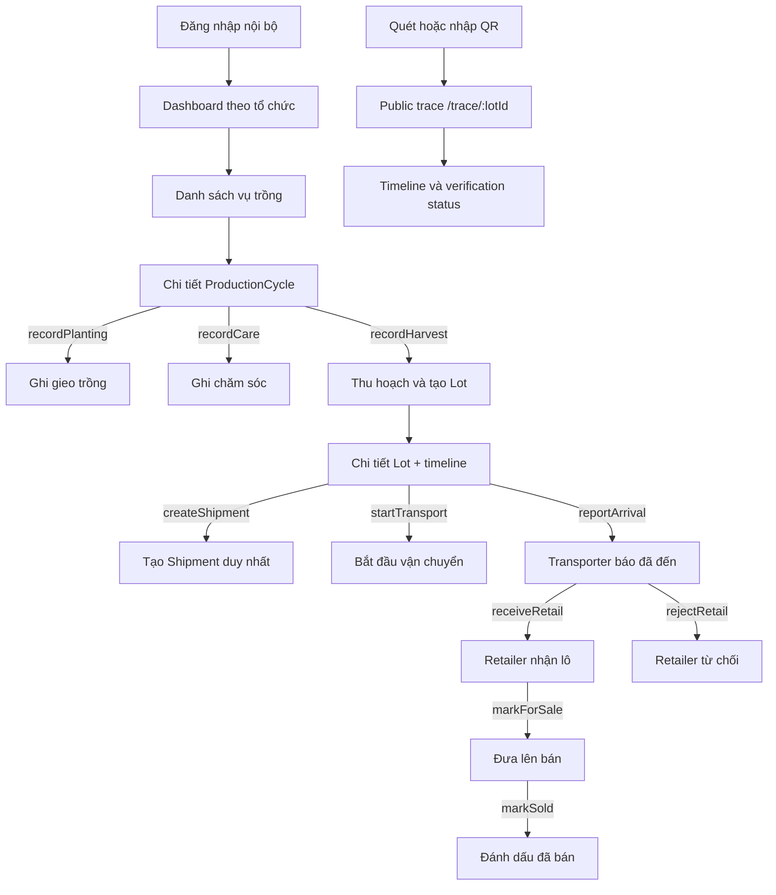

# User Flow v2

Frontend chỉ render action do API trả về trong `allowedCommands`. Frontend không tự quyết định role, ownership, custody hoặc state transition.

## FARM_STAFF

- Tạo và quản lý `ProductionCycle` thuộc farm organization của mình.
- Ghi planting, care và harvest khi cycle đang ở state hợp lệ.
- Mỗi harvest tạo một `HarvestEvent` và một `Lot`; cycle có thể tiếp tục cho lần thu hoạch khác.
- Tạo một Shipment cho Lot `HARVESTED` nếu core chưa hỗ trợ split.

## TRANSPORTER

- Chỉ thao tác Shipment được gán cho organization của mình.
- `startTransport` chuyển Lot sang `IN_TRANSPORT`.
- `reportArrival` chỉ chuyển Lot sang `ARRIVED`; không được tự xác nhận retailer đã nhận.

## RETAILER

- Chỉ receive/reject Shipment có `retailerOrgId` đúng organization hiện tại.
- Sau `ARRIVED`, chọn `receiveRetail` hoặc `rejectRetail`.
- Chỉ Lot `RETAIL_RECEIVED` mới được `markForSale`; `FOR_SALE` có thể sold, recall hoặc expire.

## CONSUMER VÀ AUDITOR

- Consumer mở `/trace/{lotId|traceToken}` mà không cần tài khoản hoặc ví blockchain.
- Public trace hiển thị Product, Farm, ProductionCycle công khai, harvest, Lot, Shipment, retailer, timeline và cảnh báo terminal state.
- Verification phân biệt `VERIFIED`, `INTEGRITY_WARNING` và `BLOCKCHAIN_UNAVAILABLE`.
- Auditor đọc lịch sử và proof theo phạm vi; không render command ghi dữ liệu.
